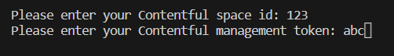
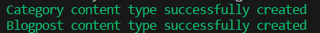

# Salesforce Commerce Cloud (SFCC) to Contentful Headless Integration

**Note:** This repository is a preview of the SFCC to Contentful Headless Integration. The purpose of this repository is to allow future customers to see the file structure of the package and to access the README and see how the package works and what features provides. The available files in this preview are:

- [category-content-type](./scripts/category-content-type.js)
- [blogpost-embed](./src/components/blogpost-embed/index.jsx)
- [contentful-fetch](./src/contentful-manager/contentful-fetch.js)
- [blogpost-detail](./src/pages/blogpost-detail/index.jsx)
- [blogpost-embed theme](./src/theme/components/blogpost-embed.js)
- [blogpost-detail theme](./src/theme/pages/blogpost-detail.js)
- [main index file](./src/index.jsx)
- [blogpost-detail test](./tests/src/pages/blogpost-detail/index-blogpost-detail.test.jsx)
- [blogpost-detail theme test](./tests/src/theme/pages/blogpost-detail.test.js)

SFCC Contentful Headless Integration is a package that integrates both Salesforce Commerce Cloud Composable Storefront and SFRA with Contentful CMS. SFCC Contentful Headless Integration offers multiple React components which add blog posts functionalities to the headless storefront of Salesforce.

## Prerequisites

1. SFCC Contentful Headless Integration is designed to work with Salesforce PWA Kit, so in order to use this package you will need to create a local project using the React Retail App template. Run the following command to create a new project:

	```shell
	npx pwa-kit-create-app@latest --preset retail-react-app-demo
	```
	For more information regarding the creation and usage of the React Retail App refer to the [Salesforce Developer documentation page](https://developer.salesforce.com/docs/commerce/pwa-kit-managed-runtime/guide/getting-started.html)

2. SFCC Contentful Headless Integration is an integration with Contentful, therefore you will need to create an account in Contentful and follow a series of steps in order to properly use this package. Please refer to the [Contentful guide](./docs/contentful.md).

## Installation

1. In order to install the package, use the following command:

	```shell
	npm i @appspringtechsas/sfcc-contentful-headless-integration
	```

2. Right after the installation, you will be asked to enter the *space id* and the *management access token* in the console (see [Contentful guide](./docs/contentful.md)). If you enter the values correctly, the package executes a script that creates the content types needed.

	

	If the creation is successful, you should see two messages in the console that confirm the creation of both the Category and Blogpost content types.

	

	If the creation of the content types fails, you can trigger the creation of the content types again by using the following commands:

	```shell
	cd node_modules/@appspringtechsas/sfcc-contentful-headless-integration
	```
	```shell
	npm run create-content-types
	```	

3. Once the package has been installed, go to the root of the pwa-kit and create a new js file and add the following code snippet:

	```javascript
	import { createContentfulClient } from '@appspringtechsas/sfcc-contentful-headless-integration'

	export const client = createContentfulClient(space_id, access_token)
	```
	Replace *space_id* and *access_token* with the corresponding values (see [Contentful guide](./docs/contentful.md))

4. The pwa-kit contains directives for HTTP security headers, so you need to add the images and the content delivery from Contentful to these directives, if this is not done, you will not be able to query the content from Contentful. Go to the **app** folder in pwa-kit project and open the *ssr.js* file and search *helmet*, which contains an object and one of its properties is called *directives*; add **'images.ctfassets.net'** to **'img-src'** array and **'cdn.contentful.com'** to **'connect-src'** array and save the file. Do not delete the other values that are already in there, just add the new ones

5. SFCC Contentful Headless Integration provides four components: **BlogpostList**, **BlogpostDetail**, **BlogpostCarousel** and **BlogpostEmbed**

6. In order to use **BlogpostCarousel** and **BlogpostEmbed**, go to the page in the pwa-kit project in which you want to include these components and add the following code snippets:

	```javascript
	import { client } from '../../../contentful-client'
	import { BlogpostCarousel, BlogpostEmbed } from '@appspringtechsas/sfcc-contentful-headless-integration'

	<BlogpostCarousel client={client}/>
	<BlogpostEmbed client={client} blogpostSlug={'blog-post-slug'}/>
	```
	In the parameter *blogpostSlug* of **BlogpostEmbed** change *blog-post-slug* for the slug of any of your blog posts

7. Using **BlogpostList** and **BlogpostDetail** will require that you create two new folders in **app/pages/** for each component, for example **app/pages/blogpost-list** and **app/pages/blogpost-detail**. Create an *index.jsx* file inside each of those folders and the following snippets:

	```javascript
	//This is the index.jsx of the blogpost-list folder
	import React from 'react'
	import { client } from '../../../contentful-client'
	import { BlogpostList } from '@appspringtechsas/sfcc-contentful-headless-integration'

	const PostList = () => {
		return <BlogpostList client={client} />
	}

	PostList.getTemplateName = () => 'blogpost-list'

	export default PostList
	```
	```javascript
	//This is the index.js of the blogpost-detail folder
	import React from 'react'
	import { client } from '../../../contentful-client'
	import { BlogpostDetail } from '@appspringtechsas/sfcc-contentful-headless-integration'

	const PostDetail = () => {
		return <BlogpostDetail client={client} />
	}

	PostDetail.getTemplateName = () => 'blogpost-detail'

	export default PostDetail
	```
	Now, you need to create two routes for these components, to do this, go to the *routes.jsx* file in the pwa-kit in **app** folder. Inside the file add the following code:
	```javascript
	const PostDetail = loadable(() => import('./pages/blogpost-detail'), {fallback})
	const PostList = loadable(() => import('./pages/blogpost-list'), {fallback})
	```
	Then you can create the routes for each page. Go to the *routes* array and add the two routes above the *PageNotFound* route or else, the new routes are not going to be identified by the project:
	```javascript
	const routes = [
		{
			path: '/blogpost-detail/:blogpostSlug',
			component: PostDetail
		},
		{
			path: '/blogpost-list/:catName?',
			component: PostList
		},
		{//This route is already in the pwa-kit. Do not delete or modify it
			path: '*',
			component: PageNotFound
		}
	]
	```
	Do not delete or modify the routes that are already in the array, just add the two routes from above

8. Search the theme *index.js* file of the pwa-kit in **app/theme/** and import the styles for the components:

	```javascript
	import { BlogpostEmbedTheme, BlogpostCarouselTheme, BlogpostListTheme, BlogpostDetailTheme } from '@appspringtechsas/sfcc-contentful-headless-integration'
	```
	In this same file search the *overrides* object and add the objects you imported above:
	```javascript
	const overrides = {
		BlogpostEmbedTheme,
		BlogpostCarouselTheme,
		BlogpostListTheme,
		BlogpostDetailTheme,
	}
	```
	Do not delete the values that are already in the *overrides* object, simply add the ones from the code above

9. Finally, you can build your pwa-kit project and run it:

	```shell
	npm run build
	```
	```shell
	npm run start
	```
	If you followed all the steps correctly you should be seeing the **BlogpostCarousel** and **BlogpostEmbed** in the page in which you added them and for **BlogpostList** and **BlogpostDetail**, go to each of their corresponding paths and you should see them

## Usage

SFCC Contentful Headless Integration provides four main components: **BlogpostList**, **BlogpostDetail**, **BlogpostCarousel** and **BlogpostEmbed**. All of those components use the Contentful API in order to query and display the information related to the blog posts that the user publishes in their Contentful space. For all the detailed information about the functionality of each component and how to use them, go to the [Usage documentation](./docs/usage.md) page.

## Styling

SFCC Contentful Headless Integration components have default styles that fit perfectly with the standard pwa-kit, but it also provides the mechanism to override these default styles and provide custom ones based on the need of the user. The [Styling documentation](./docs/styling.md) page explain in detail how to use the default styles and how to create custom ones.
