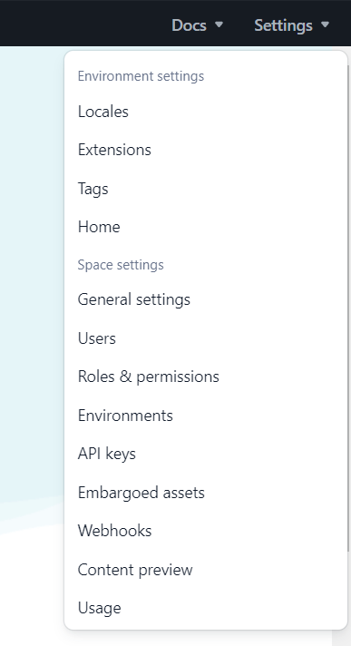
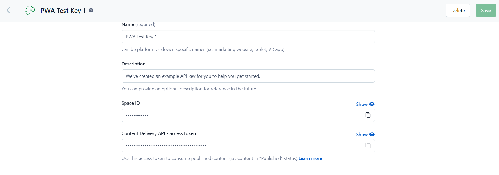
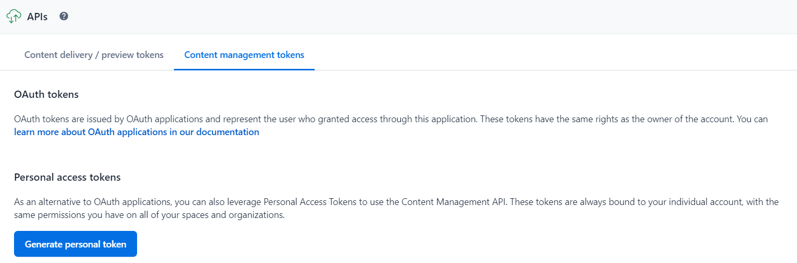
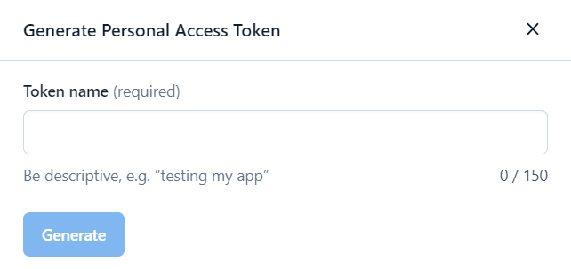
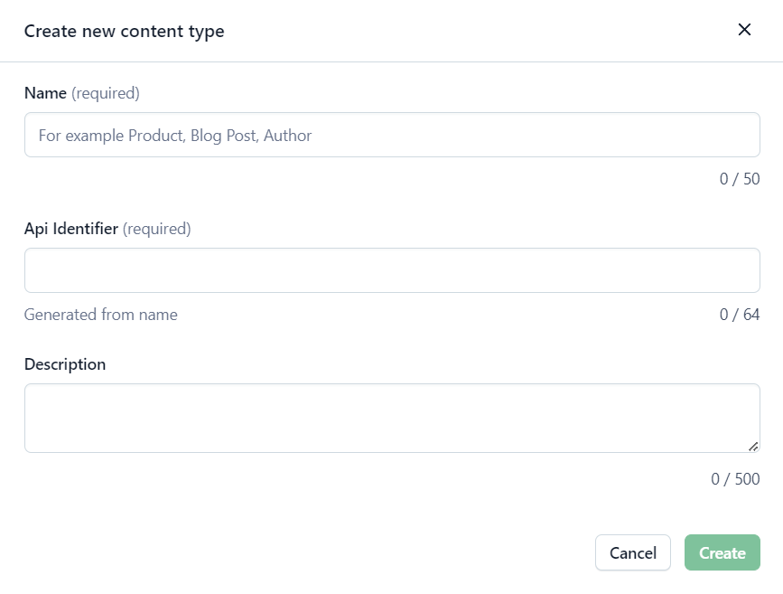
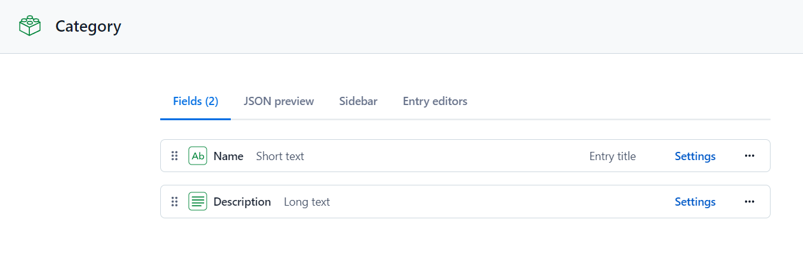
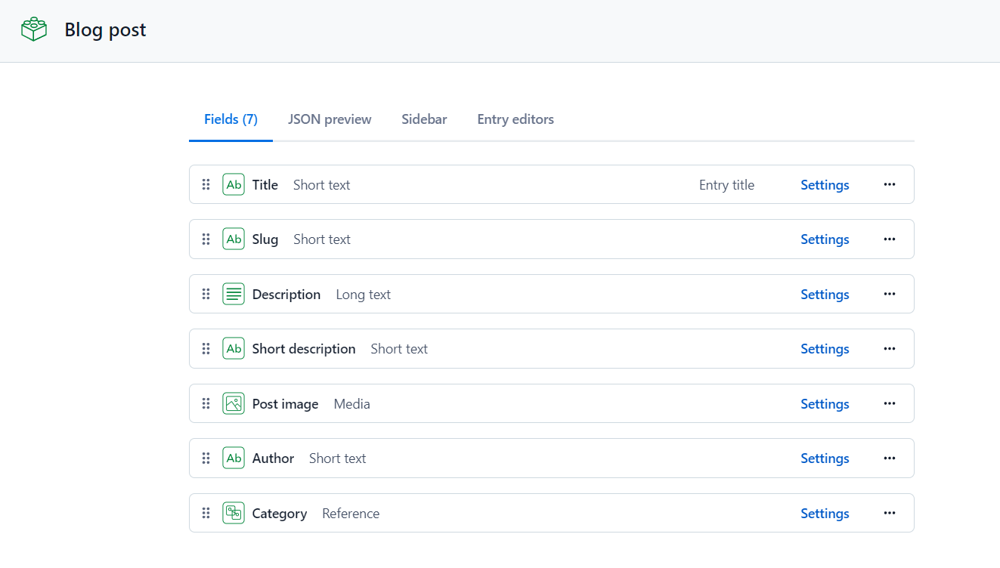

## Contentful Setup

In order to use this package you will need to follow a few steps to configure Contentful.

### Create an account

First,  you will need to create a Contentful account [here](https://www.contentful.com/sign-up/).

### Setup an API Key

After creating your account, you will need to set an API Key in order to use Contentful API. Once you have logged in, go to Settings and search for the option **API Keys**, then press **Add API key**.

This will automatically create an API Key for your space. For this package the important values are **Space ID** and **Content Delivery API - access token**.

Additionally, you will need to create a **Content management token**. To do this, in the same **API Keys** section, go to the *Content management tokens* tab and when you are there, press the **Generate personal token** button; it will immediately prompt you to enter a name for the key and after that, it will generate the key. Keep in mind that you can only see this key once, if you lose it, you will need to create a new one.

### Create the content types

**Note:** This step can be skipped since the package provides a script that creates the content types automatically

SFCC Contentful Headless Integration uses two content types in order to properly work: **Blog post** and **Category**. These content types need to be created in your space and need to have the exact same name.

To create a new content type, go to your space, to the **Content model** tab and press the **Add content type** button, this will open a modal with a small form that will ask for the content type name. You need to this twice, one for the **Blog post** content type and one for the **Category** content type.

After creating the two content types, you need to add the fields to them. To do this, go to the content type and press the **Add field** button, this will open a modal with options for the type of field you want to create. After picking the type of field, you will have to give the field a name and proceed to create it.

The fields that you need to create will be listed below and in parenthesis the type of field and a validation if needed. Keep in mind that the names of the fields need to be exactly the same as they are shown here.

**Note:** Validations for fields can be added in two ways; when you are creating the field, press 'Add and configure' and then search the *Validation* tab or, if the field has already been created, go to the *Settings* of the field and go to the *Validation* tab.

**Category fields:**
- Name (**type:** Short text, mark it as **Entry title**)
- Description (**type:** Long text)

**Blog post fields:**
- Title (**type:** Short text, mark it as **Entry title**)
- Slug (**type:** Short text, **validation:** Required field and unique field)
- Description (**type:** Long text)
- Short description (**type:** Short text)
- Post image (**type:** Media, **validation:** accept only *Image* files)
- Author (**type:** Short text)
- Category (**type:** Reference, **validation:** accept only *Category* entry type)

### Create content

Now that you have created the content types, you need to set the content or data that is going to be used. In order to create the content, go to the **Content** tab and press the **Add entry** button, which will show a dropdown with the content types that you have created before, choose one and this will take you to a form with all the fields of the selected content type. Fill all the fields and then press the **Publish** button.

After doing that, if you go back to the **Content** section, you should be able to see your newly created content in the list. You can modify each content whenever you want.

**Note:** Keep in mind that you will need to create **Category** content first in order to set a value in the **Category field** of the Blog post content.